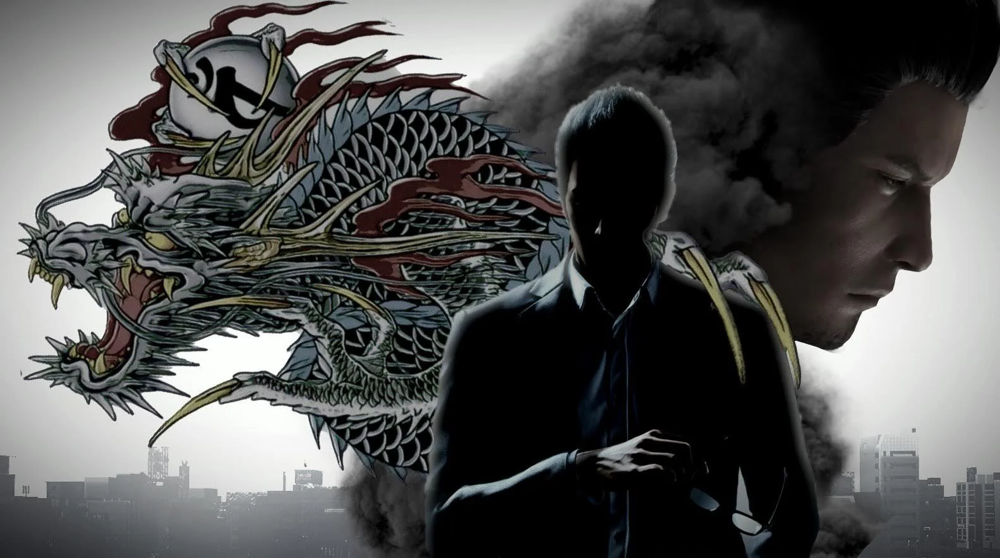

# Kiryu Kazuma Discord Bot

A feature-rich, modular Discord bot inspired by Kiryu Kazuma, the legendary Dragon of Dojima from the hit Yakuza game series. Built using [Rapptz's discord.py library](https://github.com/Rapptz/discord.py), this bot offers hybrid commands, an extensive meme library, and a scalable cog-based architecture.

## Features

- **Cog-Based Modular Design**  
  Easily extend and organize functionality using cogs for maintainable and scalable development.

- **Hybrid Commands**  
  Supports both traditional prefix commands and modern slash commands for maximum flexibility.

- **Character-Driven Personality**  
  The bot embodies Kiryu Kazuma, delivering responses and features themed around the iconic Dragon of Dojima.

- **Massive Meme Library**  
  Integrates a vast collection of memes from a separate repository, providing endless entertainment.

- **Powered by discord.py**  
  Developed with [Rapptz's discord.py library](https://github.com/Rapptz/discord.py), ensuring reliability and access to the latest Discord API features.

## Getting Started

1. **Clone the Repository**
```console
git clone https://codeberg.org/arch-based/JoryuPy.git
cd JoryuPy
```

2. **Install Dependencies**
```console
pip install -r requirements.txt
```

3. **Configure Environment Variables**  
Create a `.env` file and add your Discord bot token:
```console
DISCORD_TOKEN="your-discord-token"
```

4. **Run the Bot**
```console
python main.py
```

## Usage

- **Commands:**  
Use `/help` or the configured prefix (e.g., `td!help`) to view available commands.
- **Memes:**  
Access the meme library with `/meme` or `td!meme`.

## Meme Library

The meme library is maintained in a separate repository. Make sure to follow the setup instructions in that repository and link it as required.

## Contributing

Contributions are welcome! Please open issues or pull requests to suggest features, report bugs, or improve the bot.

## Credits

- **discord.py by Rapptz:** [GitHub Repository](https://github.com/Rapptz/discord.py)
- **Yakuza series & Kiryu Kazuma:** SEGA

---

> “If you want to laugh, laugh from the bottom of your heart!”  
> — Kiryu Kazuma

---

*This project is not affiliated with SEGA or the official Yakuza game series. For educational and entertainment purposes only.*


